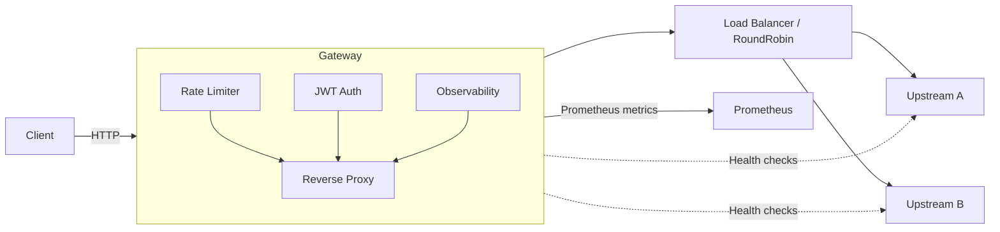

# Architecture

Components

- Rate limiting: token-bucket per-client/IP
- Health checks: periodic checks and health-aware balancing
- Observability: Prometheus metrics, tracing (JSON)
- Reverse proxy: forwards requests to upstream services
